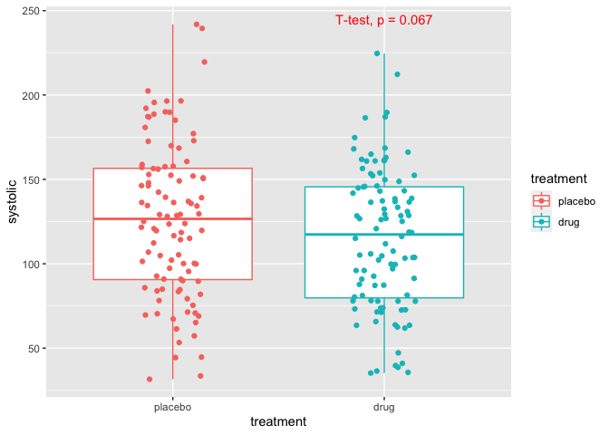

Seeing is believing
================

# Part 1

Linear modelling is a widely used method for testing the effects of
predictors on outcomes. In plain English, linear models can help us to
understand, for example, the effect of a drug treatment on a disease, or
the effect of age on body weight, etc.

## The experiment

Say we are interested in whether a new drug can treat high blood
pressure (hypertension). A clinical trial is set up to run for 30 days
with 200 patients suffering high blood pressure. Half of the patients
are given the drug daily, and half are given a placebo (sugar pill).
After 30 days, the blood pressure of all patients is measured.

Linear modelling allows us both to estimate the average difference in
blood pressure between treatment groups, and to infer whether the effect
is ‘significant’, i.e., whether the difference between groups could
simply occur by chance\*.  
Importantly for this post, linear modelling also allows us to *correct
for confounding variables* to better resolve (and plot) the effect of
interest— which in this example is the treatment.

Let’s first load the required packages and check the experimental data

``` r
devtools::install_github("bansell/partialeffects")
```

``` r
library(tidyverse)
library(moderndive)
library(skimr)
library(partialeffects)
```

``` r
experimental_data
```

    ## # A tibble: 200 × 6
    ##    subjID   age systolic treatment site  machine
    ##    <chr>  <dbl>    <dbl> <fct>     <fct> <fct>  
    ##  1 1         64    173.  placebo   1     1      
    ##  2 2         43    146.  placebo   1     2      
    ##  3 3         44     70.4 placebo   2     1      
    ##  4 4         53    136.  placebo   1     1      
    ##  5 5         53     99.8 placebo   2     3      
    ##  6 6         70    137.  placebo   2     1      
    ##  7 7         33     89.6 placebo   2     2      
    ##  8 8         54     97.3 placebo   2     1      
    ##  9 9         51     84.9 placebo   2     1      
    ## 10 10        37     57.3 placebo   2     3      
    ## # … with 190 more rows

``` r
skim(experimental_data)
```

|                                                  |                    |
|:-------------------------------------------------|:-------------------|
| Name                                             | experimental\_data |
| Number of rows                                   | 200                |
| Number of columns                                | 6                  |
| \_\_\_\_\_\_\_\_\_\_\_\_\_\_\_\_\_\_\_\_\_\_\_   |                    |
| Column type frequency:                           |                    |
| character                                        | 1                  |
| factor                                           | 3                  |
| numeric                                          | 2                  |
| \_\_\_\_\_\_\_\_\_\_\_\_\_\_\_\_\_\_\_\_\_\_\_\_ |                    |
| Group variables                                  | None               |

Data summary

**Variable type: character**

| skim\_variable | n\_missing | complete\_rate | min | max | empty | n\_unique | whitespace |
|:---------------|-----------:|---------------:|----:|----:|------:|----------:|-----------:|
| subjID         |          0 |              1 |   1 |   3 |     0 |       200 |          0 |

**Variable type: factor**

| skim\_variable | n\_missing | complete\_rate | ordered | n\_unique | top\_counts         |
|:---------------|-----------:|---------------:|:--------|----------:|:--------------------|
| treatment      |          0 |              1 | FALSE   |         2 | pla: 100, dru: 100  |
| site           |          0 |              1 | FALSE   |         2 | 2: 136, 1: 64       |
| machine        |          0 |              1 | FALSE   |         3 | 2: 94, 1: 71, 3: 35 |

**Variable type: numeric**

| skim\_variable | n\_missing | complete\_rate |   mean |    sd |   p0 |   p25 |   p50 |    p75 |   p100 | hist  |
|:---------------|-----------:|---------------:|-------:|------:|-----:|------:|------:|-------:|-------:|:------|
| age            |          0 |              1 |  53.48 | 14.26 | 30.0 | 42.00 |  52.5 |  65.25 |  80.00 | ▇▇▇▆▅ |
| systolic       |          0 |              1 | 120.61 | 44.06 | 31.6 | 85.58 | 122.6 | 152.04 | 241.86 | ▃▆▇▃▁ |

## The simplest model

For this scenario we can construct a simple linear model in R using the
`lm()` function. Here we assume that the drug treatment is the only
variable that affects blood pressure.  
(For a great introduction to linear modelling in R, check out the
excellent (and free)
[moderndive](https://moderndive.com/5-regression.html) book.)

``` r
mod <- lm(systolic ~ treatment, data = experimental_data)
```

Using the moderndive package, we can call the `get_regression_table()`
function to output a clean table of summary statistics:

``` r
get_regression_table(mod)
```

    ## # A tibble: 2 × 7
    ##   term          estimate std_error statistic p_value lower_ci upper_ci
    ##   <chr>            <dbl>     <dbl>     <dbl>   <dbl>    <dbl>    <dbl>
    ## 1 intercept        126.       4.38     28.8    0        118.   135.   
    ## 2 treatmentdrug    -11.4      6.19     -1.84   0.067    -23.6    0.788

From this we can see that the mean systolic blood pressure in the
placebo-treated (‘control’) group is 125, whereas the drug treatment
lowers the mean pressure by 11.4 units. This is a non-significant
difference as indicated by p\_value = 0.067.

## Correcting for confounding

The disappointing result from the above model may be due to other
factors or covariates that affect patient blood pressure which are
confounding the true affect of treatment. In fact, the trial involved
patients of different ages, enrolled patients from two different cities
(‘sites’), and used a variety of blood pressure machines to take
readings. Any or all of these factors/covariates may have confounded the
effect of drug treatment.

<br> </br>
<aside>

*“Factor”* in linear modelling terminology refers to a discrete variable
such as treatment status (drug vs placebo). <br> *“Covariate”* denotes a
continuous variable, such as age.  
*‘Factor’*,*‘covariate’*,*‘term’*,*‘beta’* and *‘variable’* are often
used interchangeably in the lm field. For more information, see the
Terminology table in [this
paper](https://f1000research.com/articles/9-1444).

</aside>

<br> </br> To account for these possible confounds, we create a
‘multivariate’ linear model to account for ‘multiple variables’ as the
name suggests.

``` r
mod_multi <- lm(systolic ~ treatment + age + site + machine, 
                data = experimental_data)

get_regression_table(mod_multi)
```

    ## # A tibble: 6 × 7
    ##   term          estimate std_error statistic p_value lower_ci upper_ci
    ##   <chr>            <dbl>     <dbl>     <dbl>   <dbl>    <dbl>    <dbl>
    ## 1 intercept       10.5       1.66      6.31    0         7.22    13.8 
    ## 2 treatmentdrug  -14.3       0.745   -19.2     0       -15.8    -12.8 
    ## 3 age              2.42      0.026    92.5     0         2.37     2.48
    ## 4 site2          -44.9       0.797   -56.3     0       -46.4    -43.3 
    ## 5 machine2        38.7       0.829    46.7     0        37.1     40.4 
    ## 6 machine3        -0.307     1.09     -0.282   0.778    -2.46     1.84

### Understanding summary statistics

Let’s look closely at the summary statistics table above, ignoring the
intercept for now. Compared to the simplest model, the drug treatment
now appears to reduce blood pressure by nearly 15 units, a highly
significant difference.  
Among the other factors and covariates:

-   age has a significant positive relationship blood pressure: a 2.4
    unit increase in blood pressure is observed *for every standard
    deviation unit increase* in age.
-   testing site 2 is associated with vastly lower blood pressure, and
-   machine 2 is associated with significantly higher readings, but not
    machine 3.

Somewhat confusingly, there is no estimate for the effect of placebo,
site 1 or machine 1. Why is this? The convention with linear modelling
is to set the intercept to represent the blood pressure measurement when
all factors/covariates are set to 0. Practically, this means that the
intercept represents blood pressure for those patients at site 1
measured with machine 1. But crucially, it also represents the estimated
blood pressure in patients aged *0 years*. The intercept has no real
meaning in this case.

Here, the summary statistics for the factors in the model (i.e.,
ignoring age), would be reported as: *‘Relative to patients at site 1,
tested with machine 1 and receiving the placebo…’*

### Scaling continuous covariates

When (continuous) covariates are involved, in order to create more
interpretable models its recommended to scale these variables before
beginning the modelling process. Also called ‘de-meaning’ or ‘taking the
z score’, scaling subtracts the mean from each value and divides by the
standard deviation.

NB although it’s bad practice to overwrite variables, we bend the rules
in the code below for simplicity.  
NBB scaling is tricky to implement in tidy R. A wrapper function
`scale_this()` available
[here](https://stackoverflow.com/a/35776313/5308040) could be useful if
you are using this often.

``` r
experimental_data_scaled <- experimental_data %>% 
  mutate(age = (age-mean(age)) / sd(age)) %>% 
  print()
```

    ## # A tibble: 200 × 6
    ##    subjID     age systolic treatment site  machine
    ##    <chr>    <dbl>    <dbl> <fct>     <fct> <fct>  
    ##  1 1       0.738     173.  placebo   1     1      
    ##  2 2      -0.735     146.  placebo   1     2      
    ##  3 3      -0.665      70.4 placebo   2     1      
    ##  4 4      -0.0337    136.  placebo   1     1      
    ##  5 5      -0.0337     99.8 placebo   2     3      
    ##  6 6       1.16      137.  placebo   2     1      
    ##  7 7      -1.44       89.6 placebo   2     2      
    ##  8 8       0.0365     97.3 placebo   2     1      
    ##  9 9      -0.174      84.9 placebo   2     1      
    ## 10 10     -1.16       57.3 placebo   2     3      
    ## # … with 190 more rows

Now we create a lm using the scaled covariate:

``` r
mod_scaled <- lm(systolic ~ treatment + age + site + machine,
                 data = experimental_data_scaled)

get_regression_table(mod_scaled)
```

    ## # A tibble: 6 × 7
    ##   term          estimate std_error statistic p_value lower_ci upper_ci
    ##   <chr>            <dbl>     <dbl>     <dbl>   <dbl>    <dbl>    <dbl>
    ## 1 intercept      140.        0.883   159.      0       138.     142.  
    ## 2 treatmentdrug  -14.3       0.745   -19.2     0       -15.8    -12.8 
    ## 3 age             34.6       0.374    92.5     0        33.8     35.3 
    ## 4 site2          -44.9       0.797   -56.3     0       -46.4    -43.3 
    ## 5 machine2        38.7       0.829    46.7     0        37.1     40.4 
    ## 6 machine3        -0.307     1.09     -0.282   0.778    -2.46     1.84

Note that the estimates for the factors are identical. All that has
changed is the intercept and the estimate for age. Now the intercept
represents the average blood pressure for patients *of the average age
of all study participants* at site1, measured with machine1. This works
because 0 is the average of the scaled age values, and the intercept
represents the estimated blood pressure when all covariates are set to
0.

Incidentally, the average age of participants is 53.48, so the intercept
represents the average blood pressure for patients of this age at the
end of the study *correcting for all other variables* including drug
treatment.

## Plotting the treatment effect

For scientific reporting and visual presentations we often want to show
the audience the result graphically rather than print a table of summary
statistics.

We see in the multivariate model that the treatment is effective. Can we
plot this result?

``` r
ggplot(experimental_data_scaled, aes(x=treatment, y=systolic, col=treatment)) + 
  geom_boxplot() +
  ggpubr::stat_compare_means(ref.group = 'placebo', method = 't.test', col='red') +
  geom_jitter(height=0,width=0.15)
```

<!-- -->

The above plot doesnt fit the above reported p value for the drug
treatment (p ≈ 0). As a general rule, any box plot where the upper and
lower box boundaries overlap cannot be a highly significant difference.
Further, the t.test p value calculated from the data in the plot is
unchanged from our first simple model.

### How can we show the ‘real’ treatment effect??

To do this we have to make adjustments the study data to remove the
confounding effects we identified. This is called ‘residualization’. The
systolic blood pressure for every patient in the study is predicted
based on the estimates in the linear model. In formal terms, as detailed
in [moderndive chapter 5](https://moderndive.com/5-regression.html), the
average blood pressure for patients in each treatment/site/machine
group, is calculated by linear equation

*y* = *β*<sub>0</sub> + *β*<sub>1</sub> ⋅ *x*<sub>1</sub> + *β*<sub>2</sub> ⋅ *x*<sub>2</sub>... + *β*<sub>*n*</sub> ⋅ *x*<sub>*n*</sub>
  
Here,  
*y* is the estimated blood pressure for patient *x*,  
*β*<sub>0</sub> is the intercept (i.e., average blood pressure for
patients when all other *β* covariates are set to 0),  
*β*<sub>1</sub> is the first covariate in the model (treatment), and  
*x*<sub>1</sub> is the treatment status for patient *x* expressed in
interger terms (0 for placebo, 1 for drug).  
*β*<sub>2</sub> and *x*<sub>2</sub> represent the model estimate and
measured value for patient *x* for the second term, and so on to the
*n*<sup>*t**h*</sup> term.

If we apply this to Patient 1 in the scaled experimental data:

``` r
experimental_data_scaled %>% head()
```

    ## # A tibble: 6 × 6
    ##   subjID     age systolic treatment site  machine
    ##   <chr>    <dbl>    <dbl> <fct>     <fct> <fct>  
    ## 1 1       0.738     173.  placebo   1     1      
    ## 2 2      -0.735     146.  placebo   1     2      
    ## 3 3      -0.665      70.4 placebo   2     1      
    ## 4 4      -0.0337    136.  placebo   1     1      
    ## 5 5      -0.0337     99.8 placebo   2     3      
    ## 6 6       1.16      137.  placebo   2     1

Patient 1 is in the placebo group at site 1, measured with machine 1.
The numeric values for Patient 1 for the terms ‘treatment: drug’, ‘site:
2’,‘machine: 2’ and ‘machine: 3’ , are all 0. The age of the patient is
0.73 standard units higher than the average age. To estimate the
systolic pressure for patient 1, we substitute the data specific to
Patient 1 the linear model as follows:

*systolic = intercept*  
*+ (-14.3 \* ‘treatment: drug’)*  
*+ ( 34.57 \* age )*  
*+ (-44.86 \* ‘site: 2’)*  
*+ ( 38.737 \* ‘machine: 2’)*  
*+ (-0.307 \* ‘machine: 3’)*

**which is:**

*systolic = 140.1*  
*+ (-14.3 \* 0 )*  
*+ ( 34.57 \* 0.738 )*  
*+ (-44.86 \* 0 )*  
*+ ( 38.74 \* 0 )*  
*+ (-0.307 \* 0)*

**giving:**

*systolic = 165.61*

The actual measured value for Patient 1 is 172.89. The difference
between the predicted and measured values (7.28) is the ‘residual’ or
‘error’ which is not accounted for by the current model. This is
generally attributed to ‘random variation’ between individuals. Error is
denoted ***ϵ*** in the formal linear model. Whereas the algebra above
solves for the estimated blood pressure for each patient, to calculate
the actual measured blood pressure requires adding in the random error
which is ‘left over’ when all other factors/covariates have been set to
0:

*y* = *β*<sub>0</sub> + *β*<sub>1</sub> ⋅ *x*<sub>1</sub> + *β*<sub>2</sub> ⋅ *x*<sub>2</sub>... + *β*<sub>*n*</sub> ⋅ *x*<sub>*n*</sub> + *ϵ*
  
The error can not be estimated by the linear model, and must be
calculated afterwards by subtracting the measured blood pressure from
the estimated blood pressure for each subject.

## Residualization

At this point it is also worth clarifying the terms ‘residuals’,
‘residualization’ and ‘partial residuals’.  
‘Residuals’ or ‘error’ (*ϵ*) values are those that remain once the
effects of all factors and covariates including the intercept, have been
removed for every patient in the data set.  
‘Residualization’ is the process of removing the effects of *unwanted*
or *uninteresting* variables to clarify an effect of interest. After
‘residualization’, the set of adjusted measurements are called ‘partial
residuals’.

In this example the effect of interest is the drug treatment. For
Patient 1, we want to calculate the effect of drug treatment by solving
the linear model by *adding only the intercept and treatment effects,
and then adding the error*. Patient 1 in fact belongs to the ‘intercept’
group, so there are no confounding factors to be corrected. They are
already set to 0 in the linear equation. However the patient’s blood
pressure is affected by age, and so to remove this confound from the
effect of drug treatment, the residualized data for Patient 1 would be
the *intercept + residual* (or *β*<sub>0</sub> + *ϵ* ), which is:

Partial treatment effect = *140.1 + 7.28 = 147.38*.

See how the estimated effect of age is simply dropped from the equation
during this residualization process.

### extract\_partial()

To calculate the partial residuals for drug treatment requires solving
the linear model using intercept and treatment terms, then adding the
pre-calculated error, for every patient in the study.

`extract_partial()` is a function to do just this. The function is
modelled on `moderndive::get_regression_points()` but further calculates
partial residuals (`partial_resid`) for effects of interest.

The entire `experimental_data_scaled` data is captured by the
`mod_scaled` object created above. Therefore this function needs only a
model object and the column name of the effect of interest:

``` r
partial_treatment <- extract_partial(mod_scaled, 'treatment') 
print(partial_treatment %>% select(-ID))
```

    ## # A tibble: 200 × 8
    ##    systolic treatment    age site  machine systolic_hat residual partial_resid
    ##       <dbl> <fct>      <dbl> <fct> <fct>          <dbl>    <dbl>         <dbl>
    ##  1    173.  placebo    0.738 1     1              166.     7.29           147.
    ##  2    146.  placebo   -0.735 1     2              153.    -7.11           133.
    ##  3     70.4 placebo   -0.665 2     1               72.3   -1.91           138.
    ##  4    136.  placebo   -0.034 1     1              139.    -2.64           137.
    ##  5     99.8 placebo   -0.034 2     3               93.8    6.05           146.
    ##  6    137.  placebo    1.16  2     1              135.     1.65           142.
    ##  7     89.6 placebo   -1.44  2     2               84.4    5.26           145.
    ##  8     97.3 placebo    0.036 2     1               96.5    0.812          141.
    ##  9     84.9 placebo   -0.174 2     1               89.2   -4.31           136.
    ## 10     57.3 placebo   -1.16  2     3               55.0    2.26           142.
    ## # … with 190 more rows

## Plotting the *partial* treatment effect

``` r
ggplot(partial_treatment, aes(x=treatment, y=partial_resid, col=treatment)) + 
  geom_boxplot() +
  geom_jitter(height=0,width=0.15) +
  ggpubr::stat_compare_means(ref.group = 'placebo', method = 't.test',col='red') +
  ylab('corrected systolic')
```

<!-- -->

**Now the summary statistics table, the plot and the displayed p value
are all in agreement!**

This approach will scale to handle any number of covariates, and can
accommodate mixed effects and generalized linear models. To see examples
of plotting the progressive removal of confounding effects, and how
`extract_partial()` can work for gene expression analysis, [read
on](link).
